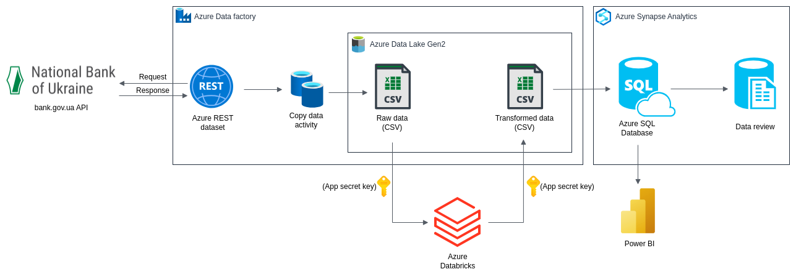
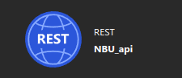
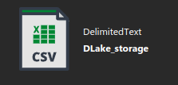

# azure_nbu_currency_exchange_rate

This project, **azure_nbu_currency_exchange_rate**, is designed to provide users with exchange rate information for various currencies to hryvnia over a specified time period. 

It leverages the API from the National Bank of Ukraine website to retrieve currency exchange rate data, stores it as a Delta Lake dataset, processes the data using Databricks, sends it to Azure Synapse Analytics, and ultimately creates a table in a newly created database for analysis. 

Additionally, the project connects an external PowerBI service to the database, allowing users to visualize and interact with the data via a dashboard.

## Architecture

The project follows a multi-step architecture:

1. **User Input**: The user chooses the time period for which they want to receive exchange rate data for specific currencies.

The API request looks something like this:

https://bank.gov.ua/NBU_Exchange/exchange_site?start=start-date&end=end-date&valcode=currency&sort=sort-by-column&order=desc-or-asc&json

The user can change the following values in the request according to his own needs:

* start-date 
* end-date 
* currency 
* sort-by-column 
* desc-or-asc

For detailed explanation and examples you can visit [this website](https://bank.gov.ua/en/open-data/api-dev)

2. **Data Retrieval**: The project utilizes the National Bank of Ukraine's API to fetch the relevant exchange rate data based on the user's input.

1. **Data Storage**: The received data is stored as a Delta Lake dataset. File type is CSV.

4. **Data Processing**: Databricks is used to process the stored data. 

Here, with the help of a secret key, Databricks connects to the storage account, modifies the data and saves the finished result back to the storage account in the correspondingly created folder for the processed data.

You can find the Databricks notebook in the `databricks/` directory.

5. **Data Integration**: The processed data is then sent to Azure Synapse Analytics, where it is written into a table in a newly created database. This database is designed for efficient data storage and retrieval.

6. **Analysis**: Users can perform various analytical tasks on the data within Azure Synapse Analytics, leveraging its capabilities for big data analytics and warehousing.

7. **Visualization**: An external PowerBI service is connected to the Azure Synapse Analytics database. A dashboard is built within PowerBI to provide users with interactive visualizations of the exchange rate data.

Here is an example of a graph showing the change in the exchange rate of the dollar to the hryvnia in the period from `01.01.2014` to `01.01.2023`:

## Prerequisites

Before you begin, ensure you have met the following requirements:

- Access to Azure services and necessary permissions to create and manage resources.
- A National Bank of Ukraine API.
- Databricks workspace for data processing.